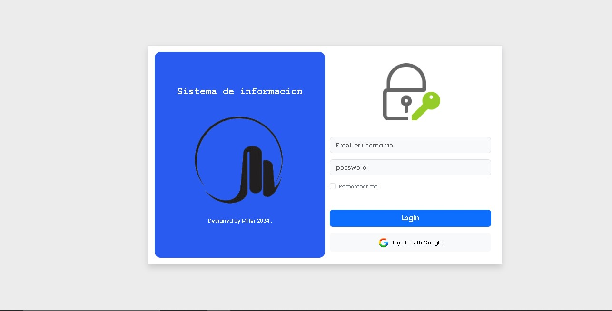

<h3>Aplicacion web consultorio odontologico</h3>

## Tecnologías Utilizadas

- Vscode
- Html
- Css
- Bootstrap
- Git
- Github
- Netlify
- Fontawesome
- PWA

  

<h3>link Deploy</h3>
https://prototipo-aplicacion-web.netlify.app/

<h3>link Repositorio Github</h3>
https://github.com/Miller38/prototipo-aplicacion-web

## Créditos.
## Designed by Milliany Tech ®2024
Yuliet Faizuli Pachon Caro - 
Nestor Fabian Gutierrez Sabogal - 
Jorge Miller Gutierrez Ospina
